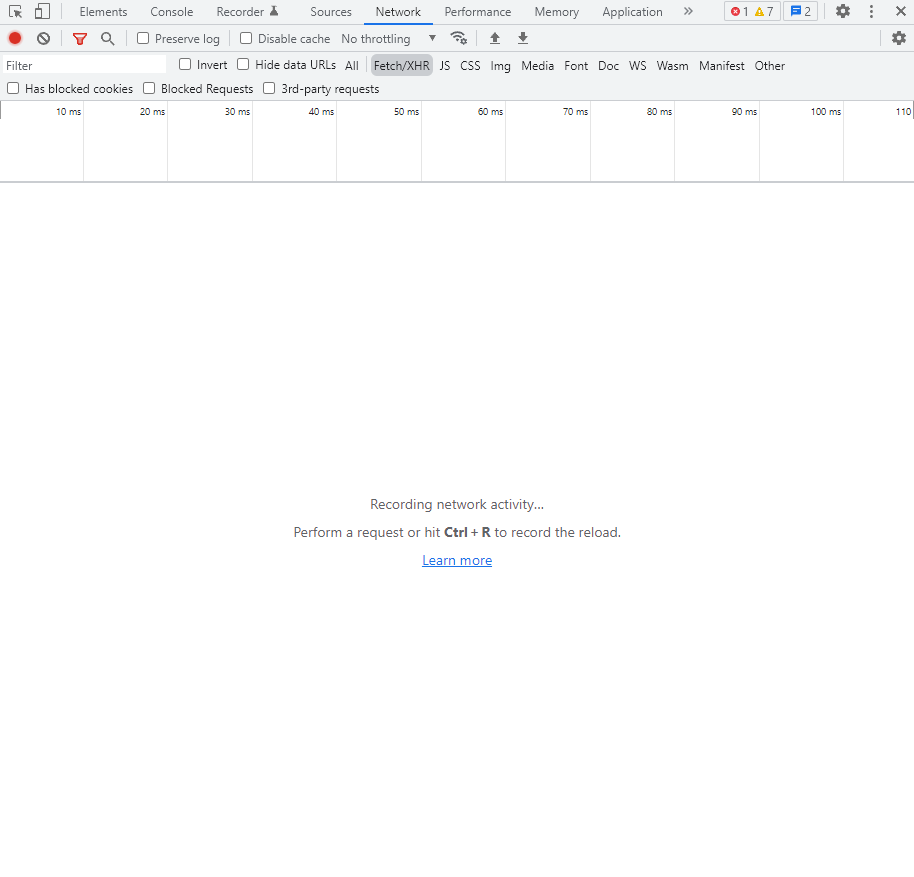
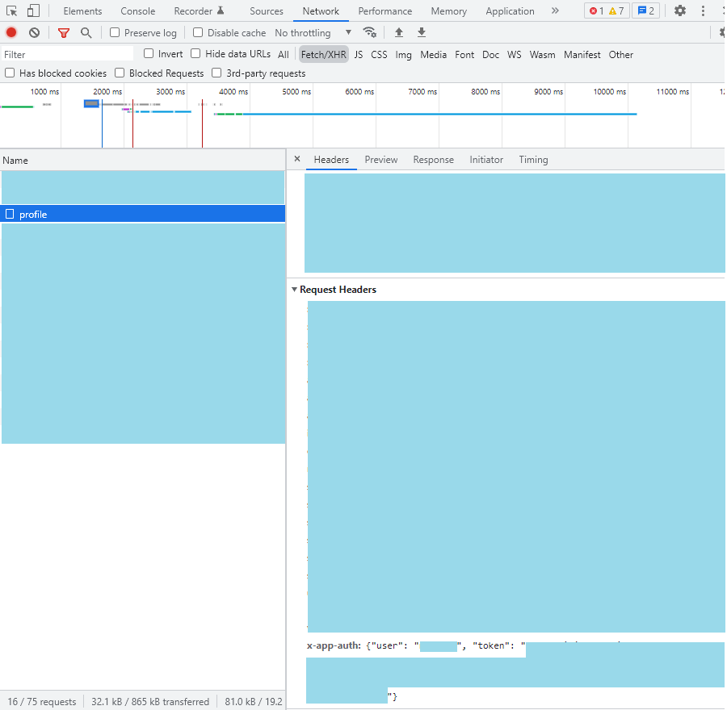

# Gettr JavaScript API
 
<div>
  <p>
    <a href="https://www.npmjs.com/package/gettr.js"></a>
    <a href="https://www.npmjs.com/package/gettr.js"></a>
  </p>
</div>

##### Official repo: https://github.com/DavidAbou/gettr.js

### Create Gettr client
```
const { GettrClient } = require('gettr.js')

const client = new GettrClient('your-username', 'your-token')
```

### Get post informations
```
const post = await client.getPost('post-id')
```
### Get user informations
```
const user = await client.getUser('username')
```
### Post message
```
client.post('your-message')
```

## How to get your token

First you need to go to https://gettr.com, then open the web console by pressing `Ctrl + Shift + I`, go to the "Network" category, check the "Fetch/XHR" filter and reload the page with `Ctrl + R` or `F5`.


Select "profile", scroll down to "Request Headers" and you will find a property named "x-app-auth", then copy the token value.


## Classes


### GettrClient

##### Properies
- username : `string`
- token : `string`
##### Methods
- getUser(`username: string`) : `Promise<User | ClientUser>`
- getPost(`id: string`) : `Promise<Post>`
- searchPost(`query: string`, `max?: number`) : `Promise<Post[]>`
- searchUser(`query: string`, `max?: number`) : `Promise<User[]>`
- getTrendings() : `Promise<Suggestion[]>`
- getPeoples() : `Promise<User[]>`
- getLiveNow() : `Promise<Post[]>`
- getTimeline() : `Promise<Post[]>`
- getRecommends() : `Promise<User[]>`
- post(`message: string`) : `Promise<Post>`

### Post

##### Properies
- id : `string`
- content : `string`
- mediaPreview : `string`
- video : `{ url: string, url_comp: string, width: number, height: number, duration: number }`
- images : `string[]`
- hashtags : `string[]`
- usertags : `string[]`
- website : `string`
- language : `string`
- likes : `number`
- reposted : `number`
- comments : `number`
- authorName : `number`
- _client : `GettrClient`
##### Methods
- fetchAuthor() : `Promise<User>`
- fetchComments() : `Promise<Post[]>`
- like() : `Promise<Post>`
- unlike() : `Promise<Post>`
- report() : `Promise<Post>`
- delete() : `Promise<Post>`
- pin() : `Promise<Post>`
- unpin() : `Promise<Post>`
- repost() : `Promise<Post>`
- undoRepost() : `Promise<Post>`

### Suggestion

##### Properies
- title : `string`
- topic : `string`
- category : `string`
- description : `string`
- iconUrl : `string`
- postId : `string[]`
- liveUrl : `string`
- _client : `GettrClient`
##### Methods
- fetchPosts() : `Promise<Post[]>`

### User

##### Properies
- username : `string`
- nickname : `string`
- description : `string`
- updatedTimestamp : `number`
- createdTimestamp : `number`
- language : `string`
- location : `string`
- website : `string`
- twitterFollowers : `number`
- twitterFollowing : `number`
- followers : `number`
- following : `number`
- verified : `boolean`
- avatarUrl : `string`
- backgroundUrl : `string`
- likedPosts : `number`
- repostedPosts : `number`
- _client : `GettrClient`
##### Methods
- fetchPosts(`max?: number`) : `Promise<Post>`
- fetchAnswers(`max?: number`) : `Promise<Post>`
- fetchMedias(`max?: number`) : `Promise<Post>`
- fetchLiked(`max?: number`) : `Promise<Post>`
- isFollowing(`username: string`) : `Promise<boolean>`
- fetchFollowers() : `Promise<User[]>`
- fetchFollowing() : `Promise<User[]>`
- follow() : `Promise<User>`
- unfollow() : `Promise<User>`
- mute() : `Promise<User>`
- unmute() : `Promise<User>`
- block() : `Promise<User>`
- unblock() : `Promise<User>`
